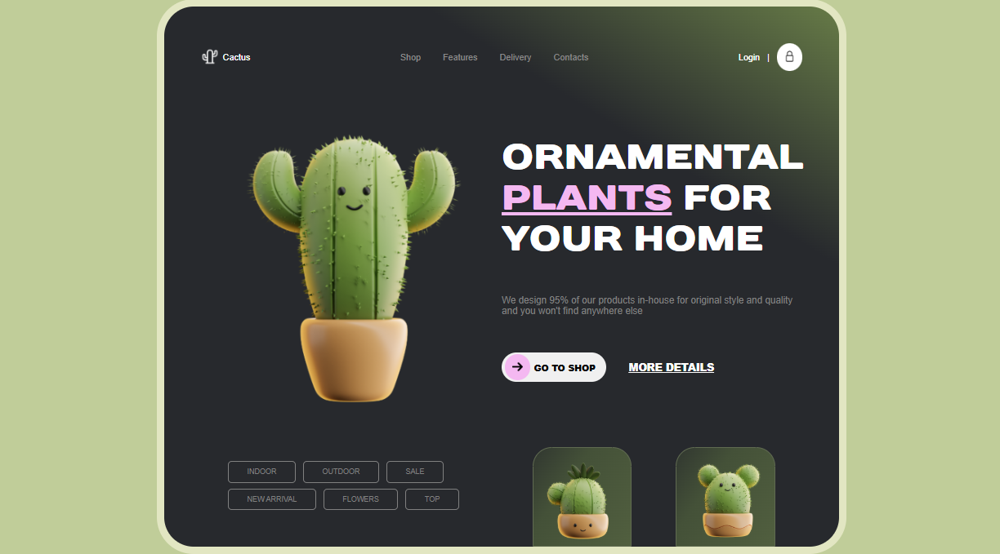

# 🎨 Clone de um Design Web do Dribble

Uma reprodução em HTML e CSS de um layout da plataforma [Dribbble](https://dribbble.com/), com foco em desenvolvimento front-end. Esse projeto foi refeito, com intuito de adicionar uma estrutura HTML melhor e mais organizada e responsividade nas páginas. 

- [Projeto Antigo](https://github.com/Arthurnes15/Cactos)

O design de inspiração foi publicado no Dribbble por [Bato](https://dribbble.com/shots/20972670-Ornamental-Plants-Shop)

## 💻 Demonstração

## ✨ Funcionalidades

- Layout responsivo
- Componentes estilizados com CSS puro

## 🛠️ Tecnologias

- HTML5 
- CSS3

## 🖌️ Atribuição de Ícone
[Next icons created by Roundicons - Flaticon](https://www.flaticon.com/free-icons/next")